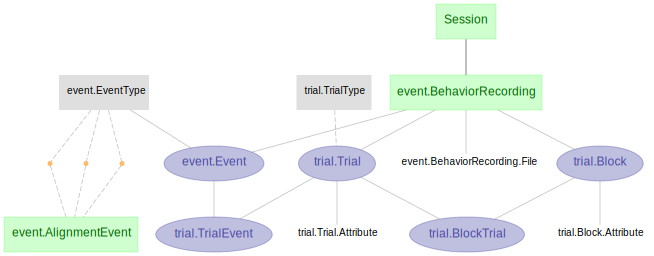

# DataJoint Element - Experimental trials

+ `element-event` features a DataJoint pipeline design for event, trial, and block management. 

+ `element-event` is not a complete workflow by itself, but rather a modular design of tables and dependencies. 

+ `element-event` can be flexibly attached to any DataJoint workflow.

+ See the [Element Event documentation](https://elements.datajoint.org/description/event/) for the background information and development timeline.

+ For more information on the DataJoint Elements project, please visit https://elements.datajoint.org.  This work is supported by the National Institutes of Health.

## Element architecture

In both of the following diagrams, the trial table starts immediately downstream from
***Session***. In one case, Sessions are first segmented into trials, and then 
segmented into events. This might be appropriate, for example, in a paradigm with 
repeated conditions and response behaviors associated with different conditions. In the 
next, Sessions are directly upstream from both Trials and Events. This might be appropriate for a paradigm that recorded events within naturalistic free behavior. We  provide an
[example workflow](https://github.com/datajoint/workflow-trial/) with a
[pipeline script](https://github.com/datajoint/workflow-trial/blob/main/workflow_trial/pipeline.py)
that models combining this Element with the corresponding 
[Element-Session](https://github.com/datajoint/element-session).

### Trial & Event Schemas



## Installation

+ Install `element-trial`
    ```
    pip install element-trial
    ```

+ Upgrade `element-trial` previously installed with `pip`
    ```
    pip install --upgrade element-trial
    ```

<!---
+ Install `element-interface`

    + `element-interface` is a dependency of `element-trial`, however it is not 
      contained within `requirements.txt`.

    ```
    pip install "element-interface @ git+https://github.com/datajoint/element-interface"
    ```
-->

## Usage

### Element activation

To activate the `element-trial`, one need to provide:

1. Schema names for the event or trial module
2. Upstream Session table: A set of keys identifying a recording session (see [
Element-Session](https://github.com/datajoint/element-session)).
3. Utility functions. See 
[example definitions here](https://github.com/datajoint/workflow-trial/blob/main/workflow_trial/paths.py)

For more detail, check the docstring of the `element-trial`:
```python
from element_trial import event, trial
help(event.activate)
help(trial.activate)
```

### Element usage

+ See the 
[workflow-calcium-imaging](https://github.com/datajoint/workflow-calcium-imaging), 
[workflow-array-ephys](https://github.com/datajoint/workflow-array-ephys), and 
[workflow-miniscope](https://github.com/datajoint/workflow-miniscope) 
repositories for example usages of `element-event`.

## Citation

+ If your work uses DataJoint and DataJoint Elements, please cite the respective Research Resource Identifiers (RRIDs) and manuscripts.

+ DataJoint for Python or MATLAB
    + Yatsenko D, Reimer J, Ecker AS, Walker EY, Sinz F, Berens P, Hoenselaar A, Cotton RJ, Siapas AS, Tolias AS. DataJoint: managing big scientific data using MATLAB or Python. bioRxiv. 2015 Jan 1:031658. doi: https://doi.org/10.1101/031658

    + DataJoint ([RRID:SCR_014543](https://scicrunch.org/resolver/SCR_014543)) - DataJoint for < Python or MATLAB > (version < enter version number >)

+ DataJoint Elements
    + Yatsenko D, Nguyen T, Shen S, Gunalan K, Turner CA, Guzman R, Sasaki M, Sitonic D, Reimer J, Walker EY, Tolias AS. DataJoint Elements: Data Workflows for Neurophysiology. bioRxiv. 2021 Jan 1. doi: https://doi.org/10.1101/2021.03.30.437358

    + DataJoint Elements ([RRID:SCR_021894](https://scicrunch.org/resolver/SCR_021894)) - Element Event (version < enter version number >)